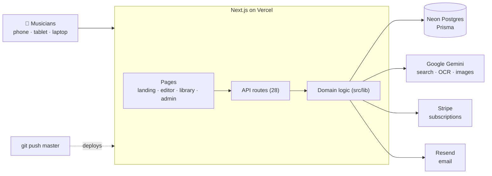
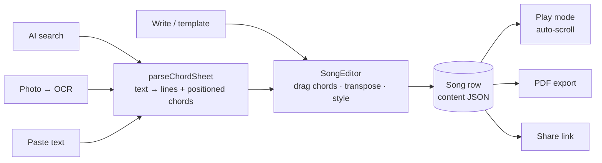
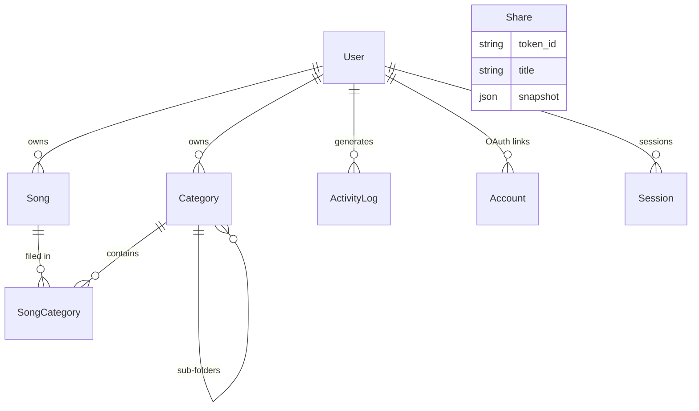
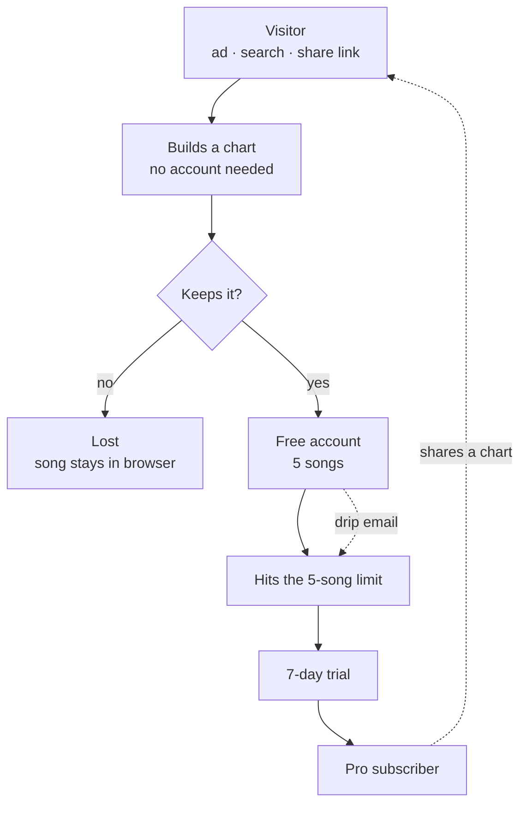

# ChordSheetMaker — System Overview & Infographic Briefs

Three things in one document:

1. **Part 1** — a comprehensive description of the whole system: product, tech
   stack, architecture, data, reliability, money, growth machinery.
2. **Part 2** — ready-to-paste prompts for AI image generators, one per poster.
3. **Appendix** — Mermaid diagrams that are *technically exact*, for when you
   need a correct reference rather than a pretty poster.

**Contents**
- [Numbers at a glance](#numbers-at-a-glance)
- [1. What the product is](#1-what-the-product-is)
- [2. What a user can do](#2-what-a-user-can-do)
- [3. Accounts, tiers and money](#3-accounts-tiers-and-money)
- [4. Tech stack](#4-tech-stack)
- [5. Code architecture](#5-code-architecture)
- [6. A request end to end](#6-a-request-end-to-end)
- [7. Data model](#7-data-model)
- [8. Reliability, safety and privacy](#8-reliability-safety-and-privacy)
- [9. Growth machinery](#9-growth-machinery)
- [10. Glossary](#10-glossary)
- [PART 2 — Infographic prompts](#part-2--infographic-prompts)
- [Appendix — exact diagrams](#appendix--exact-diagrams-mermaid)

> **Before using Part 2:** AI *image* generators draw the *impression* of an
> infographic. They misspell labels, invent boxes and mis-wire arrows. They make
> a handsome poster and a useless reference. The prompts below are written
> defensively — few boxes, short labels — and the Appendix has the accurate
> version. Ideogram and GPT-Image render text most reliably; Midjourney looks
> best but garbles words most.

---

# PART 1 — The system in words

## Numbers at a glance

| | |
| --- | --- |
| Code | ~116 TypeScript/TSX files, ~17,000 lines |
| Routes | 16 app pages + 11 SEO landing pages, 28 API endpoints |
| Domain modules | 23 (`src/lib`) |
| Database | 9 Prisma models on Neon Postgres |
| Activity events tracked | 15 types |
| Marketing email templates | 7 |
| Auto-scroll speeds | 20 steps |
| Pricing | Free · $9/mo · $79/yr, 7-day trial |

## 1. What the product is

ChordSheetMaker (chordsheetmaker.ai) turns any song into a **chord chart**:
lyrics with chord symbols sitting exactly above the syllable where each chord
change lands. A musician gets a chart in seconds, makes it beautiful, transposes
it to their key, then plays it hands-free while the page auto-scrolls.

The audience is deliberately two-sided: **gigging musicians, worship teams and
cover bands** on one side, **hobby players at home** on the other — "from sofa
to stage". Solo founder, live product, real paying customers.

## 2. What a user can do

**Get a song in — four ways**

| Path | How it works |
| --- | --- |
| AI search | Type title + artist; Gemini returns a formatted chart |
| Photo import | Photograph a printed or handwritten sheet; AI OCR reads it |
| Paste | Paste from any site; AI cleans the formatting into a real chart |
| Scratch / template | Write manually, or start from a song skeleton |

**Shape it** — drag any chord onto the exact syllable; add chord, lyric and
section lines; transpose the whole chart a semitone at a time (free for
everyone); restyle page colour, fonts, sizes and colours. The **AI styling
reads the lyrics**: it picks fonts and colours to match the song's mood, and the
**AI background** paints a scene from what the song is about. Songs group into
**setlists & collections** (folders with drag-to-reorder, sub-folders supported).

**Use it** — **Play mode** gives large type, auto-scroll across 20 speed steps,
a wake-lock so the screen never sleeps, and a *lyrics-only* toggle for singers.
**PDF export** keeps chords aligned and never strands a section header at a page
break. **Share links** are public URLs anyone can open and play, no account.

## 3. Accounts, tiers and money

- **Guest** — no account. Songs live in the browser (localStorage). The full
  editor works. On signup, guest songs migrate into the account automatically.
- **Free** — 5 songs, transposition, setlists & collections, all AI features.
- **Pro** — unlimited songs, PDF export, share links, priority support.
  **$9/month or $79/year (≈$6.60/mo)**, each starting a **7-day free trial**.

**Stripe** handles checkout and the customer portal; a webhook syncs trial,
renewal, cancellation and payment-failure states back into the database, so the
app's idea of who is paying always follows Stripe's.

## 4. Tech stack

| Layer | Technology |
| --- | --- |
| Framework | **Next.js (App Router)**, React, TypeScript |
| Styling | **Tailwind CSS v4** |
| Database | **PostgreSQL on Neon** (serverless) via **Prisma** |
| Auth | **NextAuth v5** — Google, GitHub, Apple, Resend magic links |
| AI | **Google Gemini** — search, chart parsing, photo OCR, background images, text styling |
| Email | **Resend** — magic links + marketing |
| Payments | **Stripe** — subscriptions, trials, webhooks |
| Analytics | **GA4** + a self-built activity log in Postgres |
| Hosting | **Vercel** — push to `master` deploys production |
| Notable client-side | canvas `measureText` for chord placement, html2canvas + jsPDF for export, localStorage for guests, Wake Lock API for play mode |

## 5. Code architecture

Three layers over the database, with external services at the edges.

**Routes — `src/app/`** (App Router; server components fetch, client components
interact)

| Group | Routes |
| --- | --- |
| Marketing | `/`, `/pricing`, `/terms`, `/[slug]` (11 SEO landing pages from one data file) |
| Product | `/editor/new`, `/songs`, `/view` |
| Public | `/share/[token]` |
| Admin | `/admin`, `/admin/users`, `/admin/activity` |
| Account | `/login`, `/account`, `/unsubscribe`, `/signout`, `/verify-request` |
| API (28) | `songs`, `categories`, `share`, `ai/{search,parse,ocr,background,style}`, `stripe/{checkout,portal,webhook}`, `admin/*`, `activity`, `me/entitlements`, `unsubscribe`, `client-error`, `auth/[...nextauth]` |

**Components — `src/components/`**
- `editor/` — `SongEditor` (workbench), `SongViewer` (play mode), `StylePanel`
  (fonts, colours, AI styling), `ImportModal` (the four input paths),
  `PrintView` (PDF layout), plus chord/line editing pieces
- `library/` — `SongLibraryPage`: list, category sidebar, drag & drop
- `admin/`, `ui/`, `viewer/`, `analytics/`

**Domain logic — `src/lib/` (23 modules)** — deliberately kept out of components:
`parseChordSheet` (text → structured chart), `transpose`, `chordFormat`,
`songStyle`, `pdfExport`, `plans` (single source of truth for tiers), `activity`
(event log with 30-minute throttling), `marketing` (7 templates + signed
unsubscribe), `gemini`, `stripe` + `stripeSync`, `auth`, `prisma`, `storage`
(guest localStorage), `rateLimit`, `reportError`, `notify`.

**Three decisions worth understanding**

1. **A song is one row with a JSON body.** `Song.content` holds `lines`, `style`,
   `tags`, `semitones`. Each lyric line carries chords as `{chord, position}`
   where position is a *character index*. At render time the app measures the
   real pixel width of the text before that index on a canvas — so a chord sits
   above the right syllable in any font, at any size, on any screen.
2. **`plans.ts` is the only definition of what a tier includes.** Pricing tables,
   paywalls and server-side gates all read it, so the marketing claim and the
   enforcement cannot drift apart.
3. **Guests are first-class.** The entire editor works with no account, backed by
   localStorage, and migrates on signup — the demo path is the funnel.

## 6. A request end to end

*"I type 'Wonderful Tonight' and press search."*

1. **Client** — `ImportModal` (search tab) POSTs the query to `/api/ai/search`.
2. **Guard** — the route checks the Gemini key exists, then `rateLimit()` caps
   the caller's IP at 10 searches per window (guests are allowed, so this matters).
3. **AI** — Gemini is asked for the chart; a 429 from Gemini is passed through as
   `rate_limited`, other failures become a clean 502, "no such song" a 404.
4. **Parse** — the returned text goes through `parseChordSheet`, which turns
   plain text into structured lines and lifts inline `[Am]` tokens into
   positioned chord objects.
5. **Preview → import** — the user sees the chart, hits Import; a beacon logs
   `song_imported` and the editor loads the lines.
6. **Save** — autosave POSTs `/api/songs`. For a logged-in user the server
   creates the row, logs `song_created` (tagged with its origin: `ai-search`),
   and emails the founder. For a guest it goes to localStorage and a beacon logs
   the same event anonymously.
7. **Later** — opening, editing, styling and exporting each log their own event,
   noisy ones collapsed to one row per song per 30 minutes.

## 7. Data model

Nine tables.

| Model | Holds |
| --- | --- |
| **User** | profile, plan, Stripe ids, marketing opt-out, last-email timestamp |
| **Account / Session / VerificationToken** | NextAuth: OAuth links, sessions, magic-link tokens |
| **Song** | title, artist, `content` JSON (lines + chords + style), owner, sort order |
| **Category** | setlists/collections, with optional parent for sub-folders |
| **SongCategory** | join table songs ↔ categories, with ordering |
| **Share** | public token + a snapshot of the chart. **No foreign keys** — see below |
| **ActivityLog** | 15 event types, optional user (null = anonymous guest), JSON meta |

**`Share` is deliberately detached.** It stores only `id` (the token), `title`,
`artist` and a `content` JSON copy — no `songId`, no `userId`. Consequences worth
knowing: a shared link keeps working even if the original song is edited or
deleted (the recipient sees what was shared), but there is currently **no way to
list or revoke a user's shares**, because nothing links a share back to its
owner. Adding `userId` would enable a "manage my shared links" screen.

The 15 activity events: account created · login · song created / opened /
edited / imported · chord added · style changed · AI background · AI styling ·
PDF exported · subscription started / changed / ended · marketing email.

## 8. Reliability, safety and privacy

- **Rate limiting** — in-memory sliding window per IP on the AI routes, because
  guests can use them without an account. Documented honestly in the code: state
  is per serverless instance, so it stops scripted loops and stuck clients, not a
  determined distributed attacker. Swap for Redis if real abuse appears.
- **Error reporting** — every server and client error funnels through
  `reportError`, which logs a structured line (captured by Vercel) and optionally
  POSTs to `ERROR_WEBHOOK_URL` for Slack/Discord. Zero external setup required.
- **Admin gating** — `/admin` and every `admin/*` API check the session email
  against `ADMIN_EMAILS`.
- **Share links are unguessable tokens** holding a *snapshot* — sharing never
  exposes the live library and later edits don't leak. The trade-off: a link,
  once created, cannot be revoked from inside the app (no owner is recorded).
- **Email unsubscribe is HMAC-signed** with `AUTH_SECRET` and verified in
  constant time; one-click (RFC 8058) headers satisfy Gmail/Yahoo bulk rules.
- **Guest analytics are anonymous** — a random per-browser id, no personal data,
  no cross-site tracking, and never the song content itself.
- **Logging never breaks the app** — the activity helpers swallow their own
  errors by design; a failed log must never fail a user's save.

## 9. Growth machinery

**Funnel:** ad or search → landing page → *build a chart without signing up* →
"keep your songs" prompt → free account → 5-song limit → 7-day trial → paying.

**Instrumentation:** the activity log records both users and anonymous guests, so
the founder can see exactly where people stall — including the gap between
"built a chart" and "created an account".

**Manual email drip** (admin-triggered, 3-day cooldown per person):
welcome tips → AI magic → photo rescue → band sharing → upgrade nudge →
feedback ask, plus a situational win-back. Every mail BCCs the founder and
carries a one-click unsubscribe.

**Share loop:** a shared chart shows logged-out viewers a "Make your own — free"
button. Bandmates are the warmest possible leads.

**SEO:** 11 use-case landing pages generated from a single data file.

## 10. Glossary

| Term | Meaning |
| --- | --- |
| **Chart / chord sheet** | Lyrics with chords positioned above them |
| **Section line** | A header like INTRO, VERSE 1, CHORUS |
| **Chord-only line** | A bar of chords with no lyric (intros, solos) — spaced musically, wider than lyric lines |
| **Setlist vs collection** | Same feature, different intent: gig order vs practice folder |
| **Play mode** | Full-screen auto-scrolling performance view |
| **Origin** | How a song was created: ai-search, photo, pasted-text, scratch, template, demo, duplicate |
| **Entitlements** | What the current user's plan allows, derived from `plans.ts` |

---

# PART 2 — Infographic prompts

Six posters plus an optional summary. Paste one at a time.

**Reusable style block** — every prompt already contains it; keep it identical
across posters so the set looks like a family:

> flat vector infographic, deep indigo-to-violet gradient background, white and
> pale lavender text, glowing indigo #6366f1 and violet #8b5cf6 accents, rounded
> rectangles, thin connector lines with small arrowheads, modern geometric
> sans-serif, generous negative space, subtle music motifs, flat design

**Negative prompt** (for generators that accept one):

> photorealism, 3D render, drop shadows, clutter, dense paragraphs, watermark,
> stock-photo people, skeuomorphic icons, busy background texture

**Working tips**
- Ask for the aspect ratio you need — each prompt suggests one.
- Best workflow if text does break: generate the *look*, then overlay correct
  text in Canva/Figma.

> **Tested (Jul 2026):** poster #1 run through ChatGPT's image model came back
> with every label spelled correctly — including "Next.js on Vercel" — plus
> correct Next.js, Gemini and Stripe logos and accurate captions it wrote
> itself. Longer labels are safer than the usual advice suggests with that
> model; Midjourney still garbles them. Corrections asked for in follow-up
> messages ("change Postgres to Neon Postgres") were applied without disturbing
> the rest of the image.

### How to actually run these in ChatGPT

**Don't** upload this whole file and ask for "images of the system" — it will
summarise 400 lines into its own idea of a poster and you lose the careful
prompts. Instead, one poster per message:

> Create an image using exactly the description below. Follow it literally —
> do not rewrite, shorten or add to it. Aspect ratio 16:9.
>
> [paste one prompt block from below]

Then iterate in the same chat: *"same style, but make the four service cards on
the right larger and the text bigger."* Keeping it in one conversation is how
you get a consistent set.

Notes for other tools:
- **Midjourney** — append `--ar 16:9`; drop the sentence "titled ..." if the
  title comes out misspelled, and add the title yourself afterwards.
- **Ideogram** — best text rendering of the mainstream tools; paste as-is.
- **Stable Diffusion / ComfyUI** — use the negative prompt above.
- **Mermaid appendix** — *not* for image generators. Paste those into
  [mermaid.live](https://mermaid.live) and export SVG/PNG, or just view the file
  on GitHub, which renders them natively.

---

### 1. System architecture

*Should say at a glance: one app in the middle, four services around it.*

```
Flat vector technical infographic titled "System Architecture". Deep indigo-to-
violet gradient background, white and pale lavender text, glowing indigo and
violet accents, rounded rectangles connected by thin lines with small arrowheads,
modern geometric sans-serif, generous negative space, flat design. Left: a small
group of device silhouettes labeled "Musicians". Center: one large glowing
rounded box labeled "Next.js on Vercel" containing three thin stacked bars
labeled "Pages", "API", "Logic". Right: four separate service cards stacked
vertically, each with one simple icon, labeled "Neon Postgres", "Gemini AI",
"Stripe", "Resend". Arrows flow left to right. 16:9.
```

### 2. From song to stage

*Should say at a glance: four ways in, one chart, three ways out.*

```
Flat vector process infographic titled "From Song to Stage". Deep indigo-to-
violet gradient background, white text, glowing indigo and violet accents,
rounded rectangles, thin arrows, modern geometric sans-serif, flat design. A
left-to-right pipeline. Left: four small stacked cards with simple icons
(magnifier, camera, clipboard, pencil) labeled "Search", "Photo", "Paste",
"Write". Center: one large glowing card labeled "Your chart" showing a stylized
chord sheet with short chord symbols above lyric lines. Right: three outcome
cards with icons labeled "Play", "PDF", "Share". A glowing play triangle at the
far right edge. Faint floating music notes in the background. 16:9.
```

### 3. Tech stack

*Should say at a glance: five clean layers, modern tooling.*

```
Flat vector layered tech stack poster titled "Tech Stack". Deep indigo-to-violet
gradient background, white and pale lavender text, glowing indigo accents,
rounded rectangles, modern geometric sans-serif, generous negative space, flat
design. Five horizontal bands stacked like a cake, each a rounded rectangle with
a bold label on the left, a smaller subtitle beneath it, and two small icon
circles on the right. Bands top to bottom: "Frontend" subtitle "Next.js · React
· Tailwind"; "Backend" subtitle "API routes · Prisma"; "Database" subtitle "Neon
Postgres"; "AI" subtitle "Google Gemini"; "Services" subtitle "Stripe · Resend ·
Vercel". Each band glows slightly brighter than the one below it. A thin
vertical line connects the bands down the middle. 4:5 vertical.
```

### 4. Code architecture

*Should say at a glance: four tiers, dependencies point downward.*

```
Flat vector software architecture diagram titled "Code Architecture". Deep
indigo-to-violet gradient background, white text, glowing indigo and violet
accents, thin connector lines with arrowheads, modern geometric sans-serif, flat
design, blueprint feel. Four wide horizontal tiers stacked vertically, each with
a tier label on the left edge and three small labeled boxes inside. Top tier
"Routes" containing "Landing", "Editor", "Admin". Second tier "Components"
containing "Editor", "Library", "UI". Third tier "Logic" containing "Parsing",
"Styling", "Plans". Bottom tier "Data" containing "Prisma", "Postgres",
"Storage". Downward arrows between tiers. Calm, technical, plenty of dark
negative space. 16:9.
```

### 5. Data model

*Should say at a glance: the user is the hub.*

```
Flat vector database schema diagram titled "Data Model". Dark indigo-to-violet
gradient background, white text, glowing indigo table cards, thin connector
lines with small dots at the ends, modern geometric sans-serif, flat design.
Center: one large rounded card labeled "User". Arranged evenly around it: five
smaller rounded cards labeled "Song", "Category", "Share", "Activity",
"Session". Each card shows two or three tiny blank placeholder rows beneath its
title to suggest columns. Radial layout, generous dark negative space, no
clutter. 1:1 square.
```

### 6. Growth funnel

*Should say at a glance: narrowing path, with loops feeding back in.*

```
Flat vector conversion funnel infographic titled "Visitor to Musician". Deep
indigo-to-violet gradient background, white text, glowing violet and pink
accents, modern geometric sans-serif, flat design. A wide funnel shape running
top to bottom, divided into five horizontal bands, each with a short label
inside: "Visitor", "Tries it", "Signs up", "Hits limit", "Subscriber". The
funnel narrows to a small glowing star at the bottom. To the right, three small
floating cards with curved arrows pointing back into the funnel, labeled
"Share", "Email", "Search". Faint music notes in the background. 4:5 vertical.
```

### 7. One-page overview (optional)

```
Flat vector overview poster titled "ChordSheetMaker". Deep indigo-to-violet
gradient background, white and pale lavender text, glowing indigo accents,
modern geometric sans-serif, flat design, symmetrical composition. Four
quadrants divided by thin faint lines, each with a short heading and three
simple icons: "Create" (magnifier, camera, pencil), "Style" (palette, letter A,
picture), "Play" (play triangle, phone, document), "Organise" (folder, list,
link). In the exact center, a glowing circular badge containing a treble clef.
Balanced, poster-like, lots of negative space. 1:1 square.
```

---

# Appendix — exact diagrams (Mermaid)

Correct where the posters are merely pretty. Renders on GitHub, in Notion, and
at [mermaid.live](https://mermaid.live) (which exports SVG/PNG).

### Architecture



### Song creation pipeline



### Data model

`Share` is intentionally standalone — it has no foreign keys (see §7).



### Funnel


